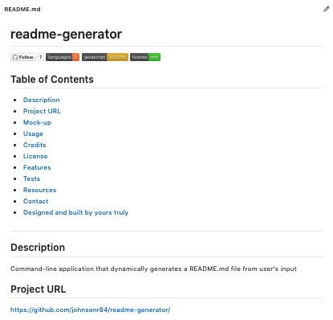

  # readme-generator 

  
  
  
  

  ## Table of Contents 
  * [Description](#Description)
  * [Project URL](#Project-URL)
  * [Mock-up](#Mock-up)
  * [Usage](#Usage)
  * [Credits](#Credits)
  * [License](#License)
  * [Features](#Features)
  * [Tests](#Tests)
  * [Resources](#Resources)
  * [Contact](#Contact)
  * [Designed and built by](#Designed-and-built-by)
  #
  
  ## Description 
  Command-line application that dynamically generates a README.md file from user's input 

  ## Project URL
  https://github.com/johnsonr84/readme-generator/ 

  ## Mock-Up
  ) 
  

  ## Installation 
  No installation required 

  ## Usage 
  Coming soon maybe 

  ## Credits 
  Me. myself and Irene 

  ## License 
  This project is [mit](https://choosealicense.com/licenses/mit/) licensed.

  ## Features
  Coming soon possibly 

  ## Tests
  No tests required at this time 

  ## Resources
  Already listed  

  * [Inquirer](https://www.npmjs.com/package/inquirer) 
  * [GitHub Mastering Markdown](https://guides.github.com/features/mastering-markdown/)
  * [Choose a License](https://choosealicense.com/)
  * [Badmath](https://img.shields.io/github/languages/top/nielsenjared/badmath)
  * [shields.io](https://shields.io/)
  * [w3schools](https://www.w3schools.com/)
  * [stackoverflow.com](https://stackoverflow.com/)
  * [01-HTML-Git-CSS/04-Important/Good-README-Guide/README.md]

  ## Contact
  Email: robertcjohnson1984@gmail.com 

  ## Designed and built by
  Author(s): Rob Johnson  

  GitHub: https://github.com/johnsonr84/ 

  